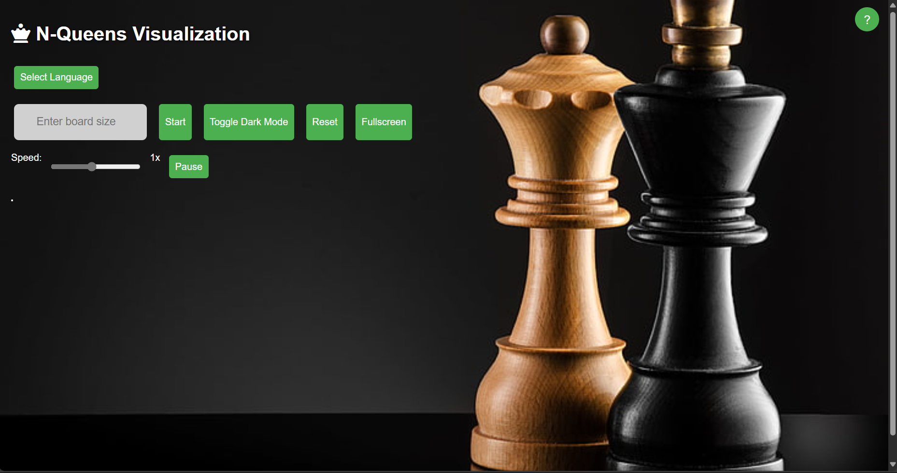

# ♛ N-Queens Visualizer

A fully interactive and animated visualizer for the classic **N-Queens Problem**, built using **HTML, CSS, and JavaScript**. This project allows users to observe the step-by-step backtracking solution of the N-Queens puzzle on a chessboard, enhanced with a modern UI and interactive controls.

---

## 🚀 Live Demo

You can view the live demo of the project at the following link:

[**N-Queens Visualizer**](https://n-queens-visualizer-mohit26.netlify.app/)

---

## 📁 Project Structure

```
N-Queens-Visualizer/
├── index.html
├── chess.jpg
├── background.mp3 (If you want to add a background sound.)
├── uk.png
├── france.png
├── germany.png
├── about.html 
└── main.png
```

---

## 🎯 About the Project

The **N-Queens problem** is a well-known algorithmic challenge that involves placing `N` queens on an `N x N` chessboard such that no two queens threaten each other. This visualizer demonstrates how the solution is constructed using **recursive backtracking**.

---

## ✨ Features

- ♟️ **Animated chessboard**: Real-time queen placement on the board
- ⏱️ **Speed control**: Adjust animation speed from slow to fast
- 🌓 **Dark mode**: Toggle between light and dark themes
- 🌐 **Multilingual support**: Interface available in English 🇬🇧, French 🇫🇷, and German 🇩🇪
- ⏸️ **Pause/Resume**: Control the flow of visualization
- 📺 **Fullscreen mode**: Focused viewing experience

---

## 🖼️ Preview

<p align="center">
  
</p>

---

## 🚀 How to Run

No installation or setup required.

1. Clone or download the repository.
2. Open the `index.html` file in your browser.
3. Choose the board size, language, and speed.
4. Click **Start** to begin the visualization.

---

## 🧠 Technologies Used

- **HTML5** – For structure and content
- **CSS3** – For styling and layout (dark mode included)
- **JavaScript** – For backtracking logic, UI interaction, and animation


